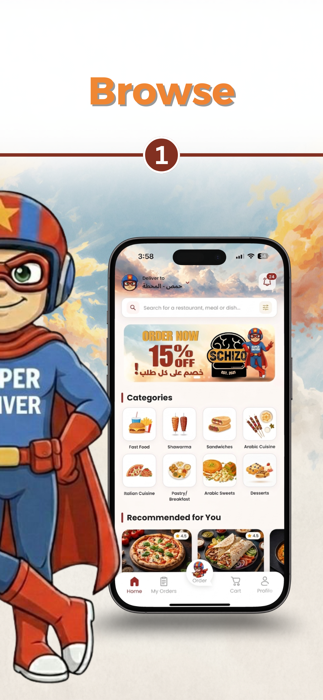
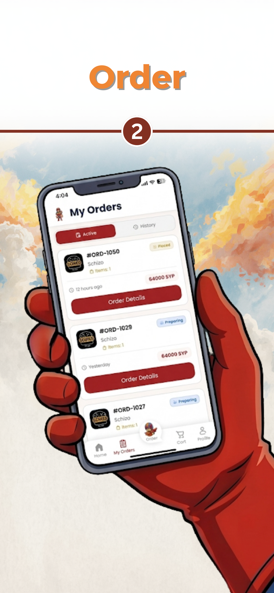
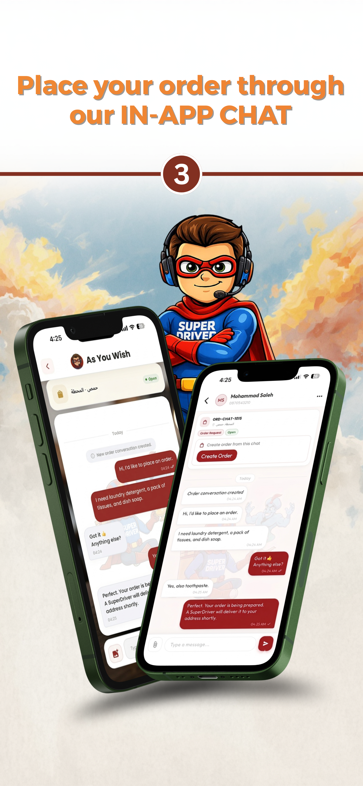
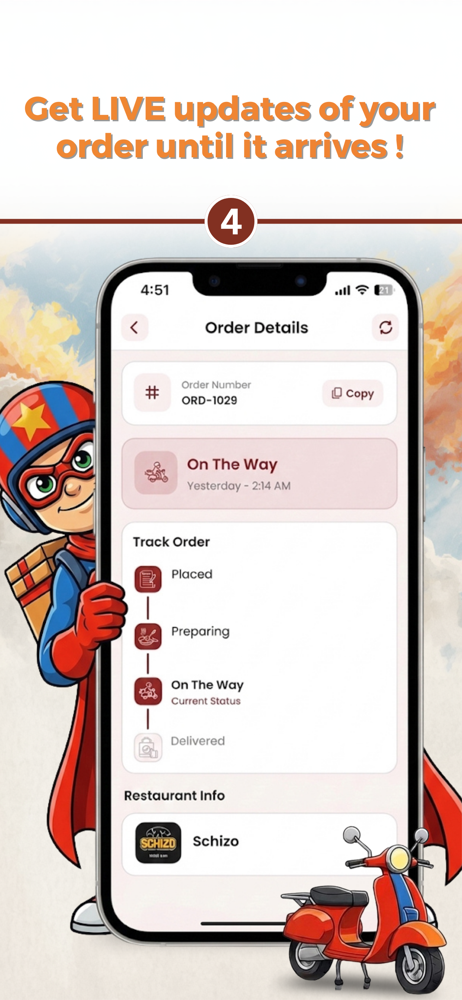

# SuperDriver

A production-grade Flutter delivery application that allows customers to browse restaurants, place orders, track deliveries in real-time, and communicate with support via chat. Built with clean architecture, bilingual support (Arabic & English), and comprehensive Firebase integration.

## Features

- **Restaurant Discovery** — Browse, search, and filter restaurants by category with nearby and trending suggestions
- **Menu & Cart** — View menus with product variations and addons, manage a multi-item cart with coupon support
- **Order Lifecycle** — Place orders, schedule deliveries, track status in real-time, reorder from history, and cancel when allowed
- **Real-Time Chat** — Order-specific support chat and emergency tickets powered by Firebase Firestore
- **Address Management** — Save multiple delivery addresses with a full-screen Google Maps picker and geocoding
- **Push Notifications** — FCM notifications with in-app notification center, badges, and unread count tracking
- **Bilingual UI** — Full Arabic and English localization with RTL support
- **Driver Reviews** — Rate drivers after delivery completion
- **Secure Auth** — Phone-based registration with OTP verification, JWT session management, and encrypted credential storage

## Tech Stack

| Layer              | Technology                                                    |
| ------------------ | ------------------------------------------------------------- |
| Framework          | Flutter 3.10+ / Dart 3.10+                                    |
| State Management   | flutter_bloc (BLoC + Cubit) with Equatable                    |
| Backend            | Django REST API                                               |
| Real-Time Database | Cloud Firestore (chat)                                        |
| Push Notifications | Firebase Cloud Messaging + flutter_local_notifications         |
| Analytics          | Firebase Analytics + In-App Messaging                         |
| Maps & Location    | Google Maps Flutter + Geolocator + Geocoding                  |
| Auth               | JWT (access + refresh tokens) with flutter_secure_storage      |
| Image Handling     | cached_network_image + image_picker                           |
| Localization       | flutter_localizations + ARB files (English, Arabic)            |
| Design             | Material 3 with Google Fonts (Outfit)                         |

## Architecture

The project follows a **three-layer clean architecture** with the BLoC pattern:

```
lib/
├── domain/                         # Business logic layer
│   ├── models/                     # 11 data models (User, Order, Cart, Restaurant, etc.)
│   └── bloc/                       # 13 BLoC/Cubit modules
│       ├── auth/                   # Login, register, OTP, password reset
│       ├── orders/                 # Order list, details, tracking
│       ├── cart/                   # Cart operations & coupon validation
│       ├── home/                   # Home screen data & suggestions
│       ├── restaurant/             # Restaurant details & menus
│       ├── menu/                   # Menu categories, products, deals
│       ├── profile/                # User profile management
│       ├── chat/                   # Chat & unread tracking
│       ├── notification/           # Notification management
│       ├── locale/                 # Language switching
│       ├── address/                # Address CRUD & geolocation
│       ├── review/                 # Driver ratings
│       └── navigation/             # Tab navigation state
├── data/                           # Data access layer
│   ├── services/                   # 13 service modules (API + Firebase)
│   ├── local_secure/               # Encrypted token storage
│   └── env/                        # API endpoints & environment config
├── presentation/                   # UI layer
│   ├── screens/                    # 35+ screens organized by feature
│   │   ├── auth/                   # Splash, login, register, OTP, password reset
│   │   └── main/                   # Home, restaurants, cart, orders, chat, profile
│   ├── components/                 # Reusable widgets
│   ├── dialogs/                    # Shared dialog components
│   ├── themes/                     # Material 3 theme & brand colors
│   └── utils/                      # Form validation & date formatting
└── l10n/                           # ARB localization files (en, ar)
```

## Key Implementation Details

- **Event-Driven BLoC** — 13 feature BLoCs with typed events and states, using Equatable for efficient rebuilds
- **Authenticated Service Layer** — HTTP services handle phone number normalization (E.164), nested error extraction, and automatic token injection
- **Secure Session Management** — Access and refresh tokens stored in encrypted storage; auto-login on app startup
- **Real-Time Chat via Firestore** — Messages stream in real-time with Cloud Functions for conversation creation and unread count syncing
- **Smart Phone Formatting** — Handles country-specific formatting rules (Saudi +966, Syrian +963, UK +44) with leading zero normalization
- **Image URL Resolution** — Transparently converts relative API paths to absolute URLs with network image caching
- **App Lifecycle Awareness** — `WidgetsBindingObserver` syncs unread counts on resume and refreshes FCM tokens on locale change

## Getting Started

### Prerequisites

- Flutter SDK 3.10.0 or later
- Google Maps API key (for address picker)
- Firebase project configured for Android and iOS
- Access to the SuperDriver backend API

### Setup

1. Clone the repository:
   ```bash
   git clone https://github.com/<your-username>/superdriver.git
   cd superdriver
   ```

2. Install dependencies:
   ```bash
   flutter pub get
   ```

3. Configure Firebase:
   - Place your `google-services.json` (Android) and `GoogleService-Info.plist` (iOS) in the appropriate platform directories
   - Update `firebase_options.dart` with your project credentials

4. Add your Google Maps API key:
   - **Android**: `android/app/src/main/AndroidManifest.xml`
   - **iOS**: `ios/Runner/AppDelegate.swift`

5. Run the app:
   ```bash
   flutter run
   ```

## Screenshots

<p align="center">
  
  
  
  
  
  
</p>
